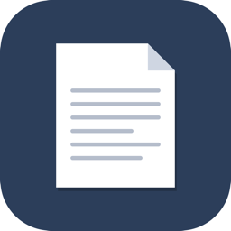
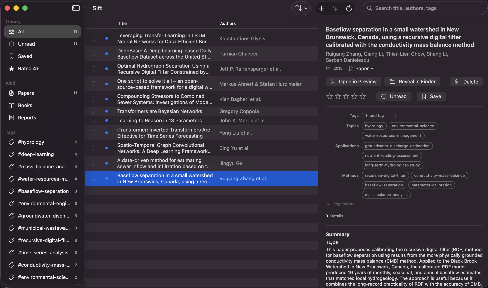

<div align="center">



<h1>Sift</h1>

<p><b>A fast, native macOS catalog for the papers you read — collect, tag, rate, recall.</b></p>

<p>
<a href="https://github.com/abhiramm7/sift/releases"><b>Download</b></a> ·
<a href="https://abhiramm7.github.io/sift/"><b>Project page</b></a>
</p>



</div>

## Why

Most reference managers try to do everything at once and get heavy doing it. Sift
does one thing well: keep track of the papers you read so you can find them again.
Collect a paper the moment you find it, tag it, rate it, and pull it back up
months later. It stays fast, native, and out of your way.

## Sync & cost

Sift has no sync server. It just writes plain files to a folder you choose, so
whatever already syncs that folder syncs your library — iCloud Drive (the
default), Google Drive, Dropbox, or OneDrive. Your papers ride on cloud storage
you already pay for instead of a separate fee: Zotero charges past its 300 MB
free tier ($20/$60/$120 a year for 2/6/unlimited GB), while iCloud's free 5 GB
alone is about 16× that. Caveats: file sync has a few-second delay (not push), and
to avoid conflicts don't edit the same library from two Macs at once. A
local-only folder works too.

## Install

1. Download `Sift-<version>.dmg` from [Releases](https://github.com/abhiramm7/sift/releases).
2. Drag `Sift.app` into `Applications`.
3. Right-click → **Open** → **Open** (ad-hoc signed, so Gatekeeper warns once).

On first launch you pick where the library lives. Default:
`~/Library/Mobile Documents/com~apple~CloudDocs/PaperManager/` (named
`PaperManager/` for legacy round-tripping — any folder works). Point it at an
existing library and your papers, tags, and ratings show up.

## Using it

- **Add:** drag a PDF onto the window, **⌘N** for a file or arXiv link, or drop
  into `<library>/inbox/` and press **⌘R**. Double-click a row in the list to
  open the PDF in Preview.
- **Organize:** sidebar filters by Library, Kind (papers / books / reports /
  posters), Folder, Author, and Tag; sort and search the list; rate 1–5; toggle
  read/saved; edit title, kind, and tags inline; **⌫** deletes to Trash. Click
  the **Authors** or **Tags** header to collapse it when those lists get long.
- **Share:** detail pane and right-click both have a Share action that opens
  the macOS share sheet — AirDrop, Mail, Messages, Notes.
- **Auto-tag (optional):** with Claude Code or Ollama installed, Sift fills
  Topics/Applications/Methods tags, fixes bad titles and authors, writes a short
  summary, and assigns a subject-area folder at ingest. The folder list is
  built from your existing library, so the LLM reuses names you already have
  instead of inventing new ones. If a pick is wrong, override it in the detail
  pane. Pick the provider and model in Settings. Works fine without either.
- **Re-extract:** one click in the detail pane re-runs the LLM on the current
  paper — for when an old paper still has a junky title.

## Build

```bash
./build.sh run     # build + launch
./build.sh debug   # faster compile
./build.sh dmg     # produces Sift-<version>.dmg
```

Requires Xcode (Swift 5.9+, macOS 14 SDK). Pure SPM, no Xcode project.

## On-disk layout

```
<library>/
├── library/<paper_id>/   paper.pdf, metadata.json
├── inbox/                drop PDFs here to ingest later
├── user/prefs.json       ratings, read/starred flags
└── tags.json             tag vocabulary
```

`paper_id` is the PDF's SHA-256, so re-ingesting a file is a no-op. The files on
disk are the source of truth; there's no separate database.

## Deliberately simple

Sift stays focused on cataloging. It opens PDFs in Preview rather than embedding
its own reader, and it syncs through iCloud Drive rather than running its own
cloud. Citation export (BibTeX, RIS, DOI) may arrive later as an optional add-on.
A Python `paper` CLI for LLM summaries, semantic search, and static-site export
lived here until 2026-06-01 and is recoverable from git history.

## License

[GNU GPLv3](LICENSE). Copyright (C) 2026 Abhiram Mullapudi.
